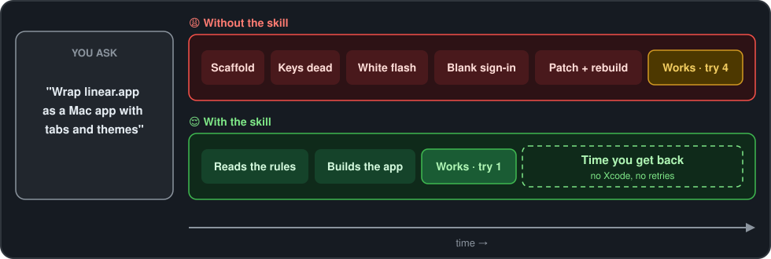

# 🌐🖥️ URL Mac Apps


> An AI skill that turns any website into a native-feeling macOS app: tabs, windows, themes and sign-in that just work.

[](LICENSE.txt) [](https://developer.apple.com/documentation/webkit/wkwebview) [](https://github.com/adriangrantdotorg/web-apps-skill/releases) [](https://github.com/adriangrantdotorg/web-apps-skill/pulls)

---

## ⬇️ Why Install?

- ⏱️ **Fewer rebuilds per app** — the AI knows the WebKit traps before it hits them
- 💸 **$0 added cost** — it rides on the AI you already pay for
- 🪶 **No Xcode, no Electron** — pure Swift, one `build.sh`, small native app

| | 😩 Without this Skill | 😌 With this Skill |
| --- | :---: | :---: |
| 🔁 Tries until it works | 🧪 3–5 | **1** |
| 🧰 Tools to install | Xcode project | **Swift command-line tools** |
| 🪤 Known WebKit traps covered | 🧪 found one by one | **70+ up front** |
| 🪙 AI usage burned on retries | 🧪 ~4× | **1×** |

<sub>🧪 estimate</sub>

---

## ✨ Features

Before writing code, the AI loads rules taken from a shipped, daily-driven wrapper app, so the first build already behaves like a Mac app.



- 🗂️ **Real tabs and windows** — ⌘T, ⌘W, several windows, the red button never quits
- 🔐 **Sign-in that completes** — Google and Apple popups return to the app instead of a blank window
- 💾 **Picks up where you left off** — tabs, windows and positions restored before anything shows
- 🎨 **Themes without the flash** — Stylus-style CSS injected before the page paints, switched from the menu bar
- 🔗 **Links go to the right place** — the site stays in-app, everything else opens in your browser
- ⌨️ **Keys work on launch** — focus, Edit menu, clipboard and zoom all wired from day one
- 🩺 **Recovers on its own** — a crashed web process reloads instead of leaving a blank window

---

## 🚀 Installation

Needs a Mac with the **[Swift toolchain](https://www.swift.org/install/macos/)** (`xcode-select --install`) and an AI assistant that supports [Agent Skills](https://github.com/anthropics/skills).


---

```bash
# Claude Code
git clone https://github.com/adriangrantdotorg/web-apps-skill.git ~/.claude/skills/url-mac-apps
# Cursor
git clone https://github.com/adriangrantdotorg/web-apps-skill.git ~/.cursor/skills/url-mac-apps
# ChatGPT & Codex
git clone https://github.com/adriangrantdotorg/web-apps-skill.git ~/.agents/skills/url-mac-apps
```

| **Platform** | **Skills folder** |
| --- | --- |
| **[Claude Code](https://code.claude.com/docs/en/skills)** | `~/.claude/skills/` |
| **[Cursor](https://cursor.com/docs/skills)** | `~/.cursor/skills/` |
| **[ChatGPT & Codex](https://learn.chatgpt.com/docs/build-skills)** | `~/.agents/skills/` |

## 💡 Usage

Describe the app you want; the skill kicks in on its own.

| You say | The skill makes |
| --- | --- |
| "Turn linear.app into a Mac app." | A **full wrapper app** with tabs, sessions, Settings and a `build.sh` that installs it |
| "Add dark themes to my Notion wrapper." | A **Themes menu** and CSS folder, applied before the page paints |
| "Sign-in with Google shows a blank window." | A **popup fix** that returns a real web view so the sign-in finishes |

---

<div align="center">
  <sub>Built with ❤️ for the macOS community & everyone who wants their web apps in the Dock ✌🏾</sub>
</div>
